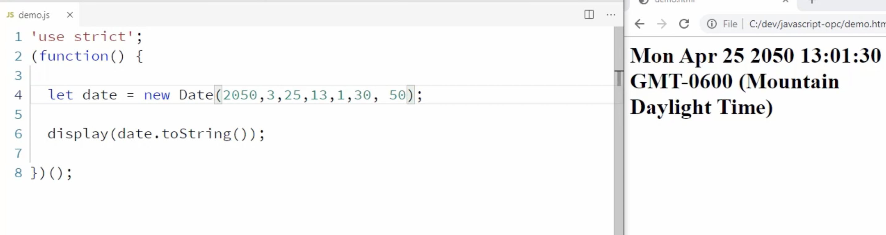

# Notes for JS: Objects, Prototypes, and Classes

Course: JavaScript Objects, Prototypes, and Classes
[Link](https://app.pluralsight.com/library/courses/javascript-objects-prototypes-classes/table-of-contents)

## Table of Contents
- [ Creating Javascript Objects](#creating-javascript-objects)
- [ JavaScript object properties](#javaScript-object-properties)
- [ JavaScript prototypes and interfaces](#javaScript-prototypes-and-interfaces)
- [ JavaScript classes](#javaScript-classes)
- [ User built-in JavaScript objects](#user-built-in-javaScript-objects)


## Creating Javascript Objects

1. **Using Object literals**: You can create an object using the object literal syntax. This is the most common way to create an object.
    ```javascript
    const person = {
        name: 'John',
        age: 32,
        partTime: false,
        showInfo: function(realAge) {
            console.log(`${this.name} is ${realAge}`);
        }
    };
    ```
    Javascript objects are dynamic. You can add properties to an object at any time. Unlike statically typed languages, you don't have to declare the properties of an object before using them like you would in Java or C#.
    **Note:** This is a powerful feature as you don't have to define the structure of an object before using it but the issue with that is, you JS code can't be validated by a compiler. You can't be sure that the object you are using has the properties you expect it to have. This can lead to runtime errors.

2. **Using shorthand syntax**: You can create an object using shorthand property names. This is less common.
    ```javascript
    let createUser = function(firstName, lastName, age) {
        let person = {
            firstName,
            lastName,
            age
        };
        display(person); // {firstName: "John", lastName: "Doe", age: 32}
    };
    ```
    The above code is equivalent to:
    ```javascript
    let createUser = function(firstName, lastName, age) {
        let person = {
            firstName: firstName,
            lastName: lastName,
            age: age
        };
        display(person); // {firstName: "John", lastName: "Doe", age: 32}
    };
    ```

    **Note:** The shorthand property names are useful when you want to create an object using variables. You can use the variable name as the property name and the variable value as the property value.

    **Applying shorthand to functions**
    ```javascript
    let person = {
        ...
        showInfo() {
            console.log(`${this.firstName} is ${this.age}`);
        }
    };
    ```
    The above code is equivalent to:
    ```javascript
    let person = {
        ...
        showInfo: function() {
            console.log(`${this.firstName} is ${this.age}`);
        }
    };
    ```
    **Important:** The shorthand syntax for functions is only available in object literals and classes. You can't use it in other places like when you are passing a function as an argument to another function.

3. **Using the new keyword**: You can create an object using the new keyword. This is less common.
    ```javascript
    const person = new Object();
    person.name = 'John';
    person.age = 32;
    person.partTime = false;
    person.showInfo = function(realAge) {
        console.log(`${this.name} is ${realAge}`);
    };
    ```

4. **Using a constructor function**: You can create an object using a constructor function. This is less common.
    ```javascript
    function Person(name, age, partTime) {
        this.name = name;
        this.age = age;
        this.partTime = partTime;
        this.showInfo = function(realAge) {
            console.log(`${this.name} is ${realAge}`);
        };
    }
    const john = new Person('John', 32, false);
    ```
    **Note:** The constructor function is a regular function. The only difference is that it is called using the new keyword. When you call a function using the new keyword, the following things happen:
    - A new empty object is created.
    - The new object is passed to the function as the this parameter.
    - The function executes.
    - The new object is returned from the function.

    **Important:** The constructor function is a regular function. You can call it without the new keyword. If you do that, the this parameter will be set to the global object (window in the browser). This can lead to unexpected results.

5. **Object Prototype:** Object (with big `O`) is a prototype (we will learn later) is inherited by all objects in JavaScript. It contains common properties and methods that are available to all objects. For example, all objects have the toString() method. This method is defined in the Object prototype. You can call it on any object.
    ```javascript
    const person = {
        name: 'John',
        age: 32,
        partTime: false,
        showInfo: function(realAge) {
            console.log(`${this.name} is ${realAge}`);
        }
    };
    person.toString(); // [object Object]
    ```
    **Note:** The toString() method returns a string representation of an object. The default implementation returns [object Object]. You can override this method to return a custom string representation of an object.

    **Important:** The Object prototype is the root of the prototype chain. All objects inherit from it. It is the only object that doesn't have a prototype. The prototype of an object is the object that it inherits from. You can access the prototype of an object using the Object.getPrototypeOf() method.
    ```javascript
    const prototype = Object.getPrototypeOf(person);
    display(prototype); // {constructor: ƒ, toString: ƒ}
    ```
    **Note:** The prototype of an object is the object that it inherits from. You can access the prototype of an object using the Object.getPrototypeOf() method.

    `Object.keys()` method returns an array of the object's own properties. It doesn't include the properties that are inherited from the prototype chain.
    ```javascript
    const keys = Object.keys(person);
    display(keys); // ["name", "age", "partTime", "showInfo"]
    ```

6.  **Object Equality:** There are 3 ways to compare
 - `==`: Double equals, this should be avoided as much as possible and is useful only in rare cases like when you want to compare an input string value to a numericaal value e.g. "100" == 100, that is it.
 - `===`: Triple equals, this should be used almost all the time.
 - `Object.is(object1, object2)`: Less common, very much similar to `===` except for following mathematical differences.
 
 Difference between `===` & `Object.is()`:
  - In `===` NaN is not equal to NaN but in `Object.is()` they are equal.
  - In `===` +0 is equal to -0 but in  `Object.is()` they are **not** equal.

 **Note:** Two objects are only equal if the both point to same memory address. 
 

 


7. **Object Methods:** 
 - `Object.assign([target Object], [source obj1], [source obj2]...)`: This method is used to copy the properties from one object to another. It takes two arguments, the target object and the source object. It copies the properties from the source object to the target object. It returns the target object.
    ```javascript
    const target = {};
    const source = {firstName: 'John', lastName: 'Doe'};
    Object.assign(target, source);
    display(target); // {firstName: "John", lastName: "Doe"}
    ```
    **Note:** If the target object already has a property with the same name, it will be overwritten. If you want to copy the properties from multiple source objects, you can pass more than two arguments to the Object.assign() method.
    ```javascript
    const target = {};
    const source1 = {firstName: 'John'};
    const source2 = {lastName: 'Doe'};
    Object.assign(target, source1, source2);
    display(target); // {firstName: "John", lastName: "Doe"}
    ```
    **Important:** The Object.assign() method only copies the properties from the source object to the target object. It doesn't create a link between the two objects. If you change the source object, the changes won't be reflected in the target object.
    ```javascript
    const target = {};
    const source = {firstName: 'John', lastName: 'Doe'};
    Object.assign(target, source);
    source.firstName = 'Jane';
    display(target); // {firstName: "John", lastName: "Doe"}
    ```
    **Note:** If you use `===` on the target and source objects, you will see that they are not equal. This is because they are two different objects. They just happen to have the same properties.

    Another great use of Object.assign() is when we want to merge two object's properties for example:
    ```javascript
    let patient = {
        name: 'John',
        age: 23
    };

    let healthStats = {
        height: 180,
        weight: 80
    };
    
    Object.assign(patient, healthStats);
    display(patient); // {name: "John", age: 23, height: 180, weight: 80}
    ```
    
    Now, one possible issue with this approach is that it modifies the original object. If you don't want to modify the original object, you can pass an empty object as the first argument to the Object.assign() method. This will create a new object and copy the properties from the source objects to it.

    ```javascript
    let newPatient = Object.assign({}, patient, healthStats);
    // {} is target object, patient is source object, healthStats is source object
    display(newPatient); // {name: "John", age: 23, height: 180, weight: 80}
    display(patient); // {name: "John", age: 23}
    ```

 **Good Immutability practice says:** A function should **not** modify the original object. It should create a new object and copy the properties from the original object to it. This is called immutability. It is a good practice to follow. It makes your code easier to reason about. It also helps you avoid bugs.

 - `Object.freeze(object)`: This method is used to freeze an object. A frozen object can't be modified. It is immutable. It takes an object as an argument and returns the frozen object.
    ```javascript
    const person = {
        name: 'John',
        age: 32
    };
    Object.freeze(person);
    person.age = 40;
    display(person); // {name: "John", age: 32}
    ```
    **Note:** The Object.freeze() method only freezes the object at the top level. It doesn't freeze the objects inside it. If you want to freeze the objects inside it, you have to call the Object.freeze() method on them.
    ```javascript
    const person = {
        name: 'John',
        age: 32,
        address: {
            city: 'New York'
        }
    };
    Object.freeze(person);
    person.address.city = 'Chicago';
    display(person); // {name: "John", age: 32, address: {city: "Chicago"}}
    ```

 - `Object.create()`: **Not common** This method is used to create a new object. It takes an object as an argument and returns a new object that inherits from the object that was passed to it.
    ```javascript
    const person = {
        name: 'John',
        age: 32
    };
    const newPerson = Object.create(person);
    display(newPerson); // {}
    display(newPerson.__proto__); // {name: "John", age: 32}
    ```
    **Note:** The newPerson object doesn't have any properties. It inherits the properties from the person object. You can access the prototype of an object using the __proto__ property. This property is not part of the standard. It is a non-standard property. It is supported by all major browsers. It is also supported by Node.js.

    **Important:** The Object.create() method is useful when you want to create an object that inherits from another object. This is called prototypal inheritance. It is a powerful feature of JavaScript. It allows you to create objects that inherit from other objects. This is a very flexible way to create objects. It is also a very efficient way to create objects. You can create multiple objects that inherit from the same object. This allows you to reuse the properties and methods of the parent object.


8. **Less Dynamic, More Static Objects:** In JS, to have objects that are static similar to what we see in other statically-typed languages like Java. We can achieve that in two ways:
 - **Constructor Functions:** We can use constructor functions to create objects. This is the most common way to create objects in JS. It is also the most flexible way to create objects. You can create objects with different properties and different methods. This is because the constructor function is a regular function. You can pass arguments to it. You can also use the this keyword inside it. This allows you to create objects with different properties and methods.
    ```javascript
    function Person(name, age) {
        this.name = name;
        this.age = age;
        this.showInfo = function() {
            display(`${this.name} is ${this.age}`);
        };
    }
    const john = new Person('John', 32);
    const jane = new Person('Jane', 28);
    john.showInfo(); // John is 32
    jane.showInfo(); // Jane is 28
    ```
    **Note:** The constructor function is a regular function. You can call it without the new keyword. If you do that, the `this` parameter will be set to the global object (window in the browser). This can lead to unexpected results.

    **Good Practice:** It is a good practice to name constructor functions with an uppercase first letter. This makes it easier to identify them.


    - **Classes:** We can use classes to create objects. This is the new way to create objects in JS. It is also the most flexible way to create objects. You can create objects with different properties and different methods. This is because the class is a template. You can pass arguments to it. You can also use the this keyword inside it. This allows you to create objects with different properties and methods.
        ```javascript
        class Person {
            constructor(name, age) {
                this.name = name;
                this.age = age;
            }
            showInfo() {
                display(`${this.name} is ${this.age}`);
            }
        }
        const john = new Person('John', 32);
        const jane = new Person('Jane', 28);
        john.showInfo(); // John is 32
        jane.showInfo(); // Jane is 28
        ```


# Module 03: Javascript object properties

1. **Bracket Notation:** Bracket notations are a great way to access an objects properties. It is useful when you want to access a property using a variable or if you want to define a property name that is not a valid identifier like `hair color` with sapce in between. For example:
    ```javascript
    const person = {
        name: 'John',
        age: 32
    };
    const propertyName = 'name';
    display(person[propertyName]); // John

    person['hair color'] = 'brown';
    display(person['hair color']); // brown
    ```
    **Note:** The bracket notation is useful when you want to access a property using a variable. You can't use the dot notation in this case. If you do that, the JavaScript engine will look for a property with the name propertyName instead of the name property.

2. **Property Descriptor:** `Object.getOwnPropertyDiscriptor([object], [propertyName])` method is used to get the property descriptor of a property. It takes two arguments, the object and the property name. It returns the property descriptor of the property. The property descriptor is an object that contains the following properties:
    - **configurable:** This property specifies whether the property can be deleted and whether its attributes can be changed.
    - **enumerable:** This property specifies whether the property can be returned in a for...in loop.
    - **value:** This property specifies the value of the property.
    - **writable:** This property specifies whether the property can be changed.
    - **get:** This property specifies the getter function for a property.
    - **set:** This property specifies the setter function for a property.
    ```javascript
    const person = {
        name: 'John',
        age: 32
    };
    const descriptor = Object.getOwnPropertyDescriptor(person, 'name');
    display(descriptor);
    /*
    {
        configurable: true,
        enumerable: true,
        value: "John",
        writable: true
    }
    */
    ```
    **Note:** The Object.getOwnPropertyDescriptor() method only returns the property descriptor of own properties. It doesn't return the property descriptor of inherited properties. If you want to get the property descriptor of inherited properties, you have to use the `Object.getPrototypeOf()` method to get the prototype of the object and then use the Object.getOwnPropertyDescriptor() method to get the property descriptor of the property.
    ```javascript
    const prototype = Object.getPrototypeOf(person);
    const descriptor = Object.getOwnPropertyDescriptor(prototype, 'toString');
    display(descriptor);
    /*
    {
        configurable: true,
        enumerable: false,
        value: ƒ toString(),
        writable: true
    }
    */
    ```

 3. **Object.defineProperty([object], [propertyName],{attributes of property to be modified}):** This method is used to modify the attributes of a property. It takes three arguments, the object, the property name, and an object that contains the attributes of the property. It returns the object that was passed to it.
    ```javascript
    const person = {
        name: 'John',
        age: 32
    };
    Object.defineProperty(person, 'name', {writable: false});
    person.name = 'Jane';
    display(person.name); // John
    ```
    **Note:** The Object.defineProperty() method only modifies the attributes of own properties. It doesn't modify the attributes of inherited properties. If you want to modify the attributes of inherited properties, you have to use the Object.getPrototypeOf() method to get the prototype of the object and then use the Object.defineProperty() method to modify the attributes of the property.
    ```javascript
    const prototype = Object.getPrototypeOf(person);
    Object.defineProperty(prototype, 'toString', {enumerable: false});
    for (let key in person) {
        display(key); // name, age
    }
    ```
 4. **Getter and Setter:** Getters and setters are special methods that are used to get and set the values of an object's properties. They are useful when you want to do something special when a property is accessed or changed. For example, you can use them to validate the values of a property. For example:
 ```javascript
    const person = {
        name: 'John',
        age: 32,
        get birthYear() {
            return new Date().getFullYear() - this.age;
        },
        set birthYear(value) {
            this.age = new Date().getFullYear() - value;
        }
    };
    display(person.birthYear); // 1987
    person.birthYear = 1985;
    display(person.birthYear); // 1985
    display(person.age); // 34
 ```


# Module 04: Javascript prototypes and interfaces

 1. **Prototype:** A prototype is a template that is used to make functions (function prototype) or create other objects.
 `Object Prototype`: An object Prototype is the object instance from whih the object is inherited. It contains common properties and methods that are available to all objects that inherit from it. For example, all objects inherit from the Object prototype. This means that all objects have the toString() method. You can call it on any object.
    ```javascript
    const person = {
        name: 'John',
        age: 32,
        showInfo: function() {
            display(`${this.name} is ${this.age}`);
        }
    };
    person.toString(); // [object Object]
    console.log(person.__proto__); // {constructor: ƒ, toString: ƒ}
    ```

 `Function Prototype`: The functions prototype is the object instance that will become the prototype for all objects created using this function as a constructor.
    ```javascript
    let myFunc = function() {
        display('Hello');
    };
    myFunc.call(); // Hello
    console.log(myFunc.prototype); // {constructor: ƒ}
    ```
  
    
    **Note:** The toString() method returns a string representation of an object. The default implementation returns [object Object]. You can override this method to return a custom string representation of an object.

    **Important:** The Object prototype is the root of the prototype chain. All objects inherit from it. It is the only object that doesn't have a prototype. The prototype of an object is the object that it inherits from. You can access the prototype of an object using the Object.getPrototypeOf() method.
    ```javascript
    const prototype = Object.getPrototypeOf(person);
    display(prototype); // {constructor: ƒ, toString: ƒ}
    ```
    **Note:** The prototype of an object is the object that it inherits from. You can access the prototype of an object using the Object.getPrototypeOf() method.

    `Object.keys()` method returns an array of the object's own properties. It doesn't include the properties that are inherited from the prototype chain.
    ```javascript
    const keys = Object.keys(person);
    display(keys); // ["name", "age", "showInfo"]
    ```


    **Important:** Methods like getters and setters live on class' prototype. They are not copied to the objects created using the class. This is because they are not part of the object's own properties. They are part of the class' prototype. They are inherited by the objects created using the class. Whereas, the properties that are defined inside the constructor function are copied to the objects created using the constructor function. This is because they are part of the object's own properties. They are not inherited by the objects created using the constructor function. 
 
 <u>Look at the two JS files in same directory for constructor functions and classes.</u>


# Module 05: Using Built-in JS Objects

There are many good-to-know and commonly used JS Global Objects like [Math](https://developer.mozilla.org/en-US/docs/Web/JavaScript/Reference/Global_Objects/Math), [Date](https://developer.mozilla.org/en-US/docs/Web/JavaScript/Reference/Global_Objects/Date) and [Regex](https://developer.mozilla.org/en-US/docs/Web/JavaScript/Reference/Global_Objects/RegExp) etc.
You can go to the MDN link and learn more!

**Note:** JS Date constructor is somehow crazy! If you look at the below example it should say March but it says April. This is because JS Date constructor starts counting months from 0. So, 0 is January, 1 is February and so on. Rest all start from 0.


