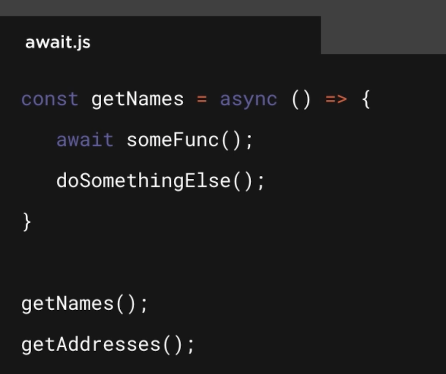

# JS Promises and Async Programming

## Resources:
 - [PluralSight Course](https://app.pluralsight.com/library/courses/javascript-promises-async-programming/table-of-contents) 
 - [Promises/A+](https://promisesaplus.com/)
 - [W3Schools](https://www.w3schools.com/js/js_callback.asp)
 - [MDN Async](https://developer.mozilla.org/en-US/docs/Learn/JavaScript/Asynchronous)

## Table of Contents
 - [Understanding Promises](#module-01-understanding-promises)
 - 

## Module 01: Understanding Promises
 - 

- Async:
    It makes a function into a Promise
    The function then returns just like a function, i.e. The return value will be

- Await:
    Must be used inside an async FUNCTION
    Only blocks current function but not the calling functions
    For example in the below tag the await for `someFunc()` will not let `doSomethingElse()` execute till `someFunc()` is executed. But the `getAddress()` will get executed irrespective of when `someFunc()` is completed.

