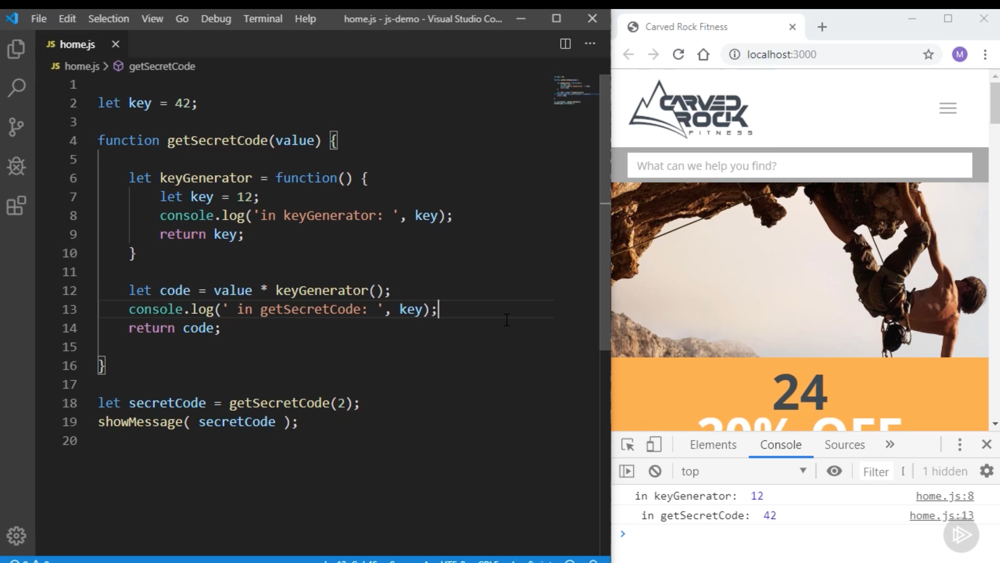

# Notes 

Course: PluralSight: JavaScript Getting Started <br>
[Course Link](https://app.pluralsight.com/library/courses/javascript-getting-started)

---

# Module 03: Javascript Beginnings
JavaScript's is mainly used to add functionality and to make changes to the HTML document. 

A basic JS code sample:
```html
<script>
    alert('Hello World!')
</script>
```

In the above code `alert()` is a function and inside it `'Hello World!'` is a string. 
You can test it yourself by going to [index.html in 03](js-getting-started/javascript-getting-started/03/demos/before/js-demo/index.html) directory


**Note:** It is best practice to separate the JS and HTML code in different files because it will keep things clear in our head and code will be clearer. Also, if JS code is in different file it can be reused for other Webpages.

To implement about best practice you use script tag and the file name for source:
```html
<script src="Relative Path of JS file"></script>
<script src="./filename.js"></script>
```

A common practice is to put frequently used functions in a `utils.js` file (Utility file) so that it can be used by multiple webpages at once.


**<u>Formatting:</u>**
In JS you can add whitespace at various places without changing the functionality of the code. Now, it doesn't mean you should!
To understand where to add whitespace while coding just follow the guidelines of the group you are in. For example:
```javascript
showMessage("Hello World!");
showMessage ("Hello World!")
```

Both the lines above are acceptable as long as you are **Consistent**.


**<u>Commenting:</u>**
Commenting is another important aspect of programming. It is one of those skills that can help differentiate new or in-experienced devs from the pros.
- Good comments are simple, short, easy to understand and are right to the point. 

In JS, you can comment using:
```javascript
// Single line comment

/*
    Multi line comment
    As many as you want! 
    It is very commonly used for Source Code licenses and copyright info.
*/
```

Comments are ignored by the engine and hence won't generate errors. 


---

## Module 04: Variables and Constants

To declare variables we use `let` keyword. Example:
```javascript
// Assigning value to 1 variable at a time:
let [variableName] = [value];
let age = 10;
let fruit = "Apple";
let vegetable = `Potato`;
let isStudent = false;

// Assigning values to multiple variables:
let price = 10.00,
    product = 'Clothes',
    isDiscount = true;
```
It is common and best practice to use comma while declaring multiple variables.

**Naming Variables:** We can use any word we want for our variables as long as it is not a `keyword`.

Rules:
 - Start with: _ $ letter
 - Followed by Zero or more: _ $ letter number
    - <u>Variable name can't start with a number.</u>

**Constants:** To define a constant, we need to use keyword `const`. Value of constans don't change once set. For example:
```javascript
const PI = 3.14;
const G_FORCE = 9.8;
```
You also need to initialize the value of constant while declaring it.


### Convention/Best Practices:
 - Use `camelCase` to name variables.
 - Use `UPPERCASE` to name constants.
 - Whenever you set a variable also set its value.
 - Variable starting with `_` Underscore is used to denote private variables or functions. For example, if you have a private function name like toonName, you can denote it as a private function by adding an underscore as a prefix (_toonName). [Blog](https://www.syncfusion.com/blogs/post/10-javascript-naming-conventions-every-developer-should-know.aspx)
 - The dollar ($) sign is used to identify object (mostly jQuery objects). Also mostly to represent code generated by computer and not human.
 - __name__ reserved for non-standard features. [link](https://stackoverflow.com/questions/6547293/why-some-attribute-names-start-with-double-underscore-in-javascript)


### Don't use var:

`let` and `const` are relatively new keywords compared to `var`. It is discouraged to use `var` as you can run into various issues while using var, for example:

The below code will give you <u>Uncaught ReferenceError</u>. Which is helpful in debugging!
```javascript
showMessage(value);
let value = "Hello World!"
```

But is we use `var` instead of `let` in the above example. <u>We won't get any error and we won't even see the expected output.</u> That is problematic! as we won't know what we did wrong and how to debug it.
```javascript
showMessage(value);
var value = "Hello World!"
```

---


# Module 05: Types and Operators

1. **Typeof Operand:**
    There a various types of variables and operators in JS. To find what type of data a variable can hold we use an operator called: `typeof`. For example:
    ```javascript
    console.log(typeof 42);
    // Expected output: "number"

    console.log(typeof 'blubber');
    // Expected output: "string"

    console.log(typeof true);
    // Expected output: "boolean"

    console.log(typeof undeclaredVariable);
    // Expected output: "undefined"
    ```

    The typeof operator returns a string indicating the type of the operand's value.

2. **Numbers and Operators:** JS supports 5 operations: Add (+), Subtract (-), Multiplication (*), Division (/), exponential (**) and Modulus aka remainder (%). Example
    ```javascript
    let price = 10;
    price = price + 10; // correct
    price += 10; // Also correct
    ```

    - JS also supports incremental and decremental operators!
    ```javascript
    let price = 10;
    ++price; // First incremented then assigned
    price++; // First assigned then incremented
    ```

3. **Operator Precedence:** Operator precendence to JS is what BODMAS is to Maths. When in an equation different operators are being used, JS use Operator precedence to calculate the result. [Table by MDN](https://developer.mozilla.org/en-US/docs/Web/JavaScript/Reference/Operators/Operator_precedence#table).


4. **Number Precision:** Number precision is another very common reason of bugs in your JS code. Let's see why, with an example:
```javascript
let price = 1.1 + 1.3;
console.log(price); 
// Expected output: 2.4
// Actual output: 2.4000000000000004
```


So, as you can see in the above example, the expected output is 2.4 but the actual output is 2.4000000000000004. This is because JS uses 64-bit floating point numbers to represent numbers. And 64-bit floating point numbers are not precise. So, to avoid this issue we can use `toFixed([precision_number])` method which returns a `string`. Example:
```javascript
let price = 1.1 + 1.3;
console.log(price.toFixed(2));
// Expected output: 2.4
// Actual output: 2.40
```

**Note:** It is important to keep this issue while comparing/playing with numbers in JS.


5. **Negative Numbers:** Negative numbers are represented by adding a `-` sign before the number. Example:
```javascript
let score = -10;
```

But while subtracting numbers, it is important that you use parenthesis to express your intentions clearly to whoever is reading you code. Example:
```javascript
let score = 10 - 5; // Correct
let score = 10 - -5; // Incorrect
let score = 10 - (-5); // Correct
```

6. **Strings:** Strings are a sequence of characters. They are represented by using single quotes or double quotes. Example:
```javascript
let name = 'John';
let name = "John";
// You can also add special characters using escape notation

```

More info on [escape notation](https://developer.mozilla.org/en-US/docs/Web/JavaScript/Reference/Global_Objects/String#escape_notation)

**String Interpolation:** String interpolation is a process of evaluating a string literal containing one or more placeholders, yielding a result in which the placeholders are replaced with their corresponding values. 
**You can only do string interpolation with backticks (`) and not with single or double quotes.**
Example:
```javascript
let name = 'John';
let message = `Hello ${name}`;
console.log(message);
// Expected output: Hello John
```

Interesting fact: while working with white spaces, on webpages, JS will ignore all the white spaces and will only show one white space but in console it will show all the white spaces. Example:
```javascript
let message = `Hello

World`;
console.log(message);
// Expected output: Hello World
// Actual output: Hello
//                World

// On webpage:  Hello World
```

7. **Manipulating Strings:** JS provides various methods to manipulate strings. Example:
```javascript
let name = 'John';
console.log(name); // Expected output: John Doe
console.log(name.length); // Expected output: 4
console.log(name.toUpperCase()); // Expected output: JOHN
console.log(name.toLowerCase()); // Expected output: john
console.log(name.charAt(0)); // Expected output: J
console.log(name.indexOf('o')); // Expected output: 1
console.log(name.indexOf('o', 2)); // Expected output: 3
console.log(name.indexOf('o', 4)); // Expected output: -1
/*
Look at the below link to understand more about indexOf method.
https://developer.mozilla.org/en-US/docs/Web/JavaScript/Reference/Global_Objects/String/indexOf
*/

console.log(name.lastIndexOf('o')); // Expected output: 3
console.log(name.startsWith('J')); // Expected output: true
console.log(name.substr(1, 2)); // Expected output: oh
console.log(name.substr(1)); // Expected output: ohn
console.log(name.substring(1, 3)); // Expected output: oh
// The two parameters of substr() are start and length , while for substring() , they are start and end .

console.log(name.split('o')); // Expected output: ['J', 'hn']
console.log(name.replace('n', 'm')); // Expected output: Johm

name = name + ' Doe';
console.log(name); // Expected output: John Doe
```
There are a lot of other methods that you can use to manipulate strings. You can find them [here](https://developer.mozilla.org/en-US/docs/Web/JavaScript/Reference/Global_Objects/String#instance_methods)


8. **Converting Strings & Numbers:** JS provides various methods to convert strings to numbers and visa versa. Example:
```javascript
// String to Number
let price = '100';
console.log(price); // Expected output: 100
console.log(typeof price); // Expected output: string
console.log(price + 10); // Expected output: 10010

price = parseInt(price);
/* or we can do
price = Number(price);
price = Number.parseInt(price);
if float 
price = parseFloat(price);
price = Number.parseFloat(price);
*/

console.log(price); // Expected output: 100
console.log(typeof price); // Expected output: number
console.log(price + 10); // Expected output: 110

// Number to String
let price = 100;
console.log(price); // Expected output: 100

price = price.toString();
console.log(price); // Expected output: 100
console.log(typeof price); // Expected output: string
```


**NOTE:** JS is pretty bad when it comes to numbers. For example when you are converting a string to number, if the string contains any character other than numbers **in starting**, JS will return NaN (Not a Number) but not when it is **in the end**. Example:
```javascript
let price = '100abc';
console.log(price); // Expected output: 100abc
price = parseInt(price);
console.log(price); // Expected output: 100

price = 'a100';
price = parseInt(price);
console.log(price); // Expected output: NaN
```

9. **Booleans:** Booleans are used to represent true or false. Example:
```javascript
let isStudent = true;
let isTeacher = !isStudent; // ! is used to negate the value of a boolean

console.log(isStudent); // Expected output: true
console.log(typeof isStudent); // Expected output: boolean
```

10. **Undefined & Null:** Undefined and Null are used to represent the absence of value. Example:
```javascript
let name;
console.log(name); // Expected output: undefined
console.log(typeof name); // Expected output: undefined

let age = null;
console.log(age); // Expected output: null
console.log(typeof age); // Expected output: object
```
**Note:** It is best practice that when you want to wipe out value of a variable, you should use `null` instead of `undefined`.

11. **Objects:** Objects are used to represent a collection of related data. Example:
```javascript
// Let's say you have a person, for a person you usually save firstName and lastName. To do that you will need 2 variables but with objects you can do it in 1 variable.
let person = {
    firstName: 'John',
    lastName: 'Doe'
};
// firstName and lastName are called properties of the object person.
// To access the properties of an object we use dot notation.
console.log(person.firstName); // Expected output: John
console.log(typeof person); // Expected output: object

// You can also add functions to an object. These functions are called methods.

let person = {
    firstName: 'John',
    lastName: 'Doe',
    getFullName: function() {
        return `${this.firstName} ${this.lastName}`;
    }
};

console.log(person.getFullName()); // Expected output: John Doe
```

**Symbols:** Symbols are used to create unique identifiers for objects. 
Symbols are often used to add unique property keys to an object that won't collide with keys any other code might add to the object, and which are hidden from any mechanisms other code will typically use to access the object.
Example:
```javascript
let person = {
    firstName: 'John',
    lastName: 'Doe',
    getFullName: function() {
        return `${this.firstName} ${this.lastName}`;
    }
};

let symbol = Symbol('age');
person[symbol] = 27;

console.log(person[symbol]); // Expected output: 27
```


---

# Module 06: Program Flow

1. **If Statements:** If statements are used to execute a block of code if a condition is true. Example:
```javascript
let age = 18;
if (age >= 18) {
    console.log('You are an adult!');
}
```

2. **Truthy & Falsy Values:** In JS, there are values that are considered as true and there are values that are considered as false. Example:

**Falsy Values:** `false`, `0`, `'' or empty string`, `null`, `undefined`, `NaN`.

**Truthy Values:** Everything else other than falsy values like `true`, `1`, `0.5`, `'a'`, `[]`, `{}`, `"0"`etc.

```javascript
// Tricky examples
if( 1.1 + 1.3 === 2.4) { // This is falsy
    console.log('True');
}

if( (1.1+1.3).toFixed(2) === 2.4) { // This is falsy too because toFixed() returns a string
    console.log('True');
}

if( (1.1+1.3).toFixed(2) == 2.4) { // This is truthy because == does type coercion
    console.log('True');
}

if( +(1.1+1.3).toFixed(2) === 2.4) { // This is truthy because + converts string to number
    console.log('True');
}
```

3. **If Else Statements:** If else statements are used to execute a block of code if a condition is true and another block of code if the condition is false. Example:
```javascript
let age = 18;
if (age >= 18) {
    console.log('You are an adult!');
} else if (age >= 13) {
    console.log('You are a teenager!');
} else {
    console.log('You are a child!');
}
```

4. **Switch Statements:** Switch statements are used to execute a block of code based on different cases. Example:
```javascript
let role = 'guest';
switch (role) {
    case 'guest':
        console.log('Guest User');
        break;
    case 'moderator':
        console.log('Moderator User');
        break;
    default:
        console.log('Unknown User');
}
```

5. **Comparing == and ===:** `==` is used to compare values and `===` is used to compare values and types. Example:
```javascript
console.log(1 == 1); // Expected output: true
console.log(1 == '1'); // Expected output: true

console.log(1 === 1); // Expected output: true
console.log(1 === '1'); // Expected output: false
// === is also called scrictly equal to operator.
```

6. **Ternary Operators:** Ternary operators are used to write if else statements in one line. Example:
```javascript
let age = 18;
let message = (age >= 18) ? 'You are an adult!' : 'You are a child!';
console.log(message); // Expected output: You are an adult!
```

---


# Module 07: Functions

1. **Function Basics:** Functions are used to group a block of code together and execute it whenever we want. Example:
```javascript
function showMessage() {
    console.log('Hello World!');
}

showMessage(); // Expected output: Hello World!
```
To define a function we use `function` keyword followed by function's name, in this case `showMessage` and then parenthesis. Inside the parenthesis we can pass parameters to the function. After that we use curly braces to define the body of the function. To execute a function we use function's name followed by parenthesis.


2. **Function Parameters:** Parameters are used to pass data to a function. Example:
```javascript
function showMessage(message) {
    console.log(message);
}

showMessage('Hello World!'); // Expected output: Hello World!
```
In the above example, `message` is a parameter of the function `showMessage`. When we call the function `showMessage` we pass a value to the parameter `message`.
Also, if you don't pass a value to the parameter, it will be `undefined` by default. Example:
```javascript
function showMessage(message, from) {
    console.log(message, from);
}

showMessage('Hello World!'); // Expected output: Hello World! undefined
```

3. **Function Expressions:** Function expressions are used to assign a function to a variable. Example:
```javascript
let showMessage = function() {
    console.log('Hello World!');
}

showMessage(); // Expected output: Hello World!
```
In the above example, `showMessage` is a variable that holds a function. We can also pass parameters to the function expression. Example:
```javascript
let showMessage = function(message) {
    console.log(message);
}

showMessage('Hello World!'); // Expected output: Hello World!
```

**Note:** It is best practice to use function expressions instead of function declarations. Also, it is best practice to give the function a name but you can't use that name, it is good to do it that way because it helps in debugging. Example:
```javascript
let printMessage = function showMessage(message) {
    console.log(message);
}

printMessage('Hello World!'); // Expected output: Hello World!
showMessage('Hello World!'); // Expected output: Error showMessage is not defined
```

4. **Function Return Values:** Functions can also return values using `return` keyword. Example:
```javascript
function sum(a, b) {
    return a + b;
}

let result = sum(1, 2);
console.log(result); // Expected output: 3
```

5. **Function Scope:** Scope is the area where a variable is accessible. Functions have access to all the variables defined in the outer scope. But a variable defined inside a function is not accessible outside the function. Example:
```javascript
let name = 'John';

function showMessage() {
    console.log(name);
}

showMessage(); // Expected output: John
```

In the below example `key` inside `keyGenerator` function gets oveerwrites the `key` variable defined outside the function. This is called **variable shadowing.**



---


# Module 08: Objects and DOM

1. **Creating Objects:** Objects are used to represent a collection of related data using properties/attributes and methods/functions. Example:
```javascript
let person = {
    firstName: 'John',
    lastName: 'Doe',
    getFullName: function() {
        return `${this.firstName} ${this.lastName}`;
    }
};

console.log(person.firstName); // Expected output: John
console.log(person['firstName']); // Expected output: John
console.log(person.getFullName()); // Expected output: John Doe
console.log(person['getFullName']()); // Expected output: John Doe

console.log(person.age); // Expected output: undefined
```

2. **Changing Properties:** We can change the value of a property of an object by using dot notation or bracket notation. Example:
```javascript
person.firstName = 'Jane';
console.log(person.firstName); // Expected output: Jane

person['lastName'] = 'Mary';
console.log(person.lastName); // Expected output: Mary
```

3. **Adding Properties:** We can add new properties to an object by using dot notation or bracket notation. Example:
```javascript
person.age = 27;
console.log(person.age); // Expected output: 27

person['isStudent'] = true;
console.log(person.isStudent); // Expected output: true
```

4. **Using Symbols:** Symbols are used to create unique identifiers for objects. They are used to add properties to an object that won't collide with keys any other code might add to the object, and which are hidden from any mechanisms other code will typically use to access the object. Example:
```javascript

let symbol = Symbol('age');
person[symbol] = 27;

console.log(person[symbol]); // Expected output: 27
console.log(person.age); // Expected output: undefined

console.log(person); // Expected output: {firstName: "John", lastName: "Doe", getFullName: ƒ, Symbol(age): 27}
```

5. **This Keyword:** `this` keyword is used to refer to the current object. Example:
```javascript
let person = {
    firstName: 'John',
    lastName: 'Doe',
    getFullName: function() {
        return `${this.firstName} ${this.lastName}`;
    }
    getFirstName: function() {
        return firstName;
    }
};

console.log(person.getFullName()); // Expected output: John Doe
console.log(person.getFirstName()); // Expected output: Error firstName is not defined
```

6. **Passing Objects to Functions:** We can pass objects to functions as parameters. Example:
```javascript
let person = {
    firstName: 'John',
    lastName: 'Doe',
    getFullName: function() {
        return `${this.firstName} ${this.lastName}`;
    }
};

function printPerson(person) {
    console.log(person.getFullName());
}

printPerson(person); // Expected output: John Doe
```

7. **Passing By Value vs Passing By Reference:** In JS, primitive types like numbers, strings, booleans are passed by value and objects are passed by reference.

8. **Standard Built-in Objects:** JS provides various built-in objects that we can use to perform various operations. To know more about them go to [MDN](https://developer.mozilla.org/en-US/docs/Web/JavaScript/Reference/Global_Objects).

9. **Document Object Model:** DOM is a tree-like structure that represents the HTML document. It is used to manipulate the HTML document. Example:
```javascript
console.log(document); // Expected output: HTMLDocument {…}
console.log(document.body); // Expected output: <body>...</body>
console.log(document.title); // Expected output: JS Getting Started
```
We can use DOM to select elements from the HTML document and manipulate them. MDN has a great documentation on DOM. In simple words, DOM basically provides a way to select elements from the HTML document and manipulate them.[Link](https://developer.mozilla.org/en-US/docs/Web/API/Document_Object_Model/Introduction)

10. **Selecting Elements:** We can select elements from the HTML document using various methods provided by DOM. Example:
```javascript
console.log(document.getElementById('message')); // Expected output: <h1 id="message">Hello World!</h1>
console.log(document.getElementsByClassName('message')); // Expected output: HTMLCollection [h1#message.message, message: h1#message.message]
console.log(document.getElementsByTagName('h1')); // Expected output: HTMLCollection [h1#message.message, message: h1#message.message]
console.log(document.querySelector('#message')); // Expected output: <h1 id="message">Hello World!</h1>
console.log(document.querySelector('.message')); // Expected output: <h1 id="message">Hello World!</h1>
console.log(document.querySelector('h1')); // Expected output: <h1 id="message">Hello World!</h1>
console.log(document.querySelectorAll('h1')); // Expected output: NodeList [h1#message.message]
```

11. **Styling Elements:** We can style elements using DOM. Example:
```javascript
let message = document.getElementById('message');
message.style.color = 'red';
message.style.backgroundColor = 'black';
message.style.fontSize = '50px';
```
 In the above example, we selected the element with id `message` and then we changed its color to red, background color to black and font size to 50px.

 *Note*: Some CSS properties have dashes in them, for example `background-color`. In JS, we can't use dashes in variable names so we use camelCase instead. Example:
 ```javascript
 message.style.backgroundColor = 'black';
 ```

12. **Interacting with webpages:** We can interact with webpages using DOM. There are various events that we can listen to and perform actions based on those events. Example:
 ```javascript
 let message = document.getElementById('message');
 message.addEventListener('click', function() {
    console.log('Clicked!');
 });
 ```
 In the above example, we selected the element with id `message` and then we added an event listener to it. The event listener listens to the click event and then executes the function passed to it.

Some other common event are:
 - `DOMContentLoaded` event. This event is fired when the HTML document is loaded. Example:
 ```javascript
 document.addEventListener('DOMContentLoaded', function() {
    console.log('DOM Loaded!');
 });
 ```
 - `load` event. This event is fired when the HTML document and all the resources like images, stylesheets, etc are loaded. Example:
 ```javascript
 window.addEventListener('load', function() {
    console.log('Page Loaded!');
 });
 ```
 - `mouseover` event. This event is fired when the mouse is over an element. Example:
 ```javascript
 let message = document.getElementById('message');
 message.addEventListener('mouseover', function() {
    console.log('Mouse Over!');
 });
 ```
 - `mouseout` event. This event is fired when the mouse is out of an element. Example:
 ```javascript
 let message = document.getElementById('message');
 message.addEventListener('mouseout', function() {
    console.log('Mouse Out!');
 });
 ```
- `keydown` event. This event is fired when a key is pressed. Example:
 ```javascript
 document.addEventListener('keydown', function() {
    console.log('Key Down!');
 });
 ```

---


# Module 09: Arrays

1. **Arrays:** Arrays are used to represent a collection of data. Example:
```javascript
let num = []; // creating an empty array
let num = Array(); // creating an empty array

let numbers = Array.of(1, 2, 3, 4, 5); // creating an array with values
let numbers = [1, 2, 3, 4, 5]; // Creating and initializing an array
console.log(numbers); // Expected output: [1, 2, 3, 4, 5]
console.log(numbers[0]); // Expected output: 1

numbers[0] = 10; // Changing the value of an element
console.log(numbers); // Expected output: [10, 2, 3, 4, 5]

numbers[5] = 6; // Adding a new element
console.log(numbers); // Expected output: [10, 2, 3, 4, 5, 6]

console.log(number[10]); // Expected output: undefined 
```

2. **Array Methods:** Arrays have various methods that we can use to manipulate them. Go to MDN to know more about them. [Link](https://developer.mozilla.org/en-US/docs/Web/JavaScript/Reference/Global_Objects/Array)
Some examples are:
```javascript
let numbers = [1, 2, 3, 4, 5];

console.log(numbers.length); // Expected output: 5
console.log(numbers.reverse()); // Expected output: [5, 4, 3, 2, 1]
console.log(numbers.sort()); // Expected output: [1, 2, 3, 4, 5]
console.log(numbers.indexOf(3)); // Expected output: 2
console.log(numbers.indexOf(6)); // Expected output: -1
console.log(numbers.join('-')); // Expected output: 1-2-3-4-5
```

3. **Slice and Splice:** Slice and Splice are used to add or remove elements from an array. Slice doesn't change the original array but Splice does. Example:
```javascript
let numbers = [1, 2, 3, 4, 5];

console.log(numbers.slice(0, 3)); // Expected output: [1, 2, 3]
console.log(numbers); // Expected output: [1, 2, 3, 4, 5]

console.log(numbers.splice(0, 3)); // Expected output: [1, 2, 3]
console.log(numbers); // Expected output: [4, 5]

let numbers = [1, 2, 3, 4, 5];
numbers.splice(1,1,"a","b","c"); // Here, we are removing 1 element from index 1 and adding 3 elements at index 1. Second argument is the number of elements to remove and the rest of the arguments are the elements to add.
console.log(numbers); // Expected output: [1, "a", "b", "c", 4, 5]
```

4. **Manupulating Arrays:** We can use various methods to manipulate arrays. Example:
```javascript
let numbers = [1, 2, 3, 4, 5];

let newNumbers = numbers.map(function(value) {
    return value * 2;
});
console.log(newNumbers); // Expected output: [2, 4, 6, 8, 10]

let newNumbers = numbers.filter(function(value) {
    return value > 3;
});
console.log(newNumbers); // Expected output: [4, 5]

let newNumbers = numbers.reduce(function(accumulator, currentValue) {
    return accumulator + currentValue;
});
console.log(newNumbers); // Expected output: 15

let newNumbers = numbers.find(function(value) {
    return value > 3;
});
console.log(newNumbers); // Expected output: 4
```

5. **Looping Through Arrays:** We can use various methods to loop through arrays. Example:
```javascript
let numbers = [1, 2, 3, 4, 5];
numbers.forEach(function(value) {
    console.log(value);
});
```

---


# Module 10: Scope and Hoisting

1. **Global Scope:** Global scope is the area where a variable is accessible throughout the program. Global scope is **sum of all the scopes/JS files**. It is best practice to avoid using global scope as much as possible. A concept called **polluting global scope** is used to describe the situation where you have a lot of variables in global scope. To avoid we can create one global variable and add all the other variables to it. Example:
```javascript

let myApp = {
    name: 'John'
};

myApp.age = 27;
myApp.printName = function() {
    console.log(this.name);
}
```

One way to avoid global scope is to use IIFE (Immediately Invoked Function Expression). Example:
```javascript
(function() {
    let name = 'John';
    console.log(name); // Expected output: John
})();
console.log(name); // Expected output: Error name is not defined
console.log(window.name); // Expected output: undefined
```

2. **Function Scope:** Function scope is the area where a variable is accessible throughout the function. Example:
```javascript
function showMessage() {
    let message = 'Hello World!';

    function printMessage() {
        let message = 'Hello World Again!';
        console.log(message); // Expected output: Hello World Again!
    }

    console.log(message); // Expected output: Hello World!
}
showMessage();
console.log(message); // Expected output: Error message is not defined
```

3. **var and Hoiisting:** `var` is used to declare variables. It is best practice to avoid using `var` as much as possible. `var` variables are hoisted to the top of the scope. 
Hoisting is a JS mechanism where variables and function declarations are moved to the top of their scope before code execution. Example:
```javascript
console.log(name); // Expected output: undefined
var name = 'John';
console.log(name); // Expected output: John
```
The above example is equivalent to:
```javascript
var name;
console.log(name); // Expected output: undefined
name = 'John';
console.log(name); // Expected output: John
```
This is a problem because we can use a variable before declaring it. To avoid this problem we can use `let` and `const` instead of `var`. Example:
```javascript
console.log(name); // Expected output: ReferenceError: Cannot access 'name' before initialization
let name = 'John';
console.log(name); // Expected output: John
```

3.2 **Function Hoisting:** Functions are also hoisted to the top of the scope. Example:
```javascript
printMessage(); // Expected output: Hello World!
function printMessage() {
    console.log('Hello World!'); // Expected output: Hello World!
}
```
The above example is equivalent to:
```javascript
function printMessage() {
    console.log('Hello World!'); // Expected output: Hello World!
}
printMessage(); // Expected output: Hello World!
```
**Important!**
This is because JS engine first scans the code and then executes it. So, when it scans the code it finds the function declaration and hoists it to the top of the scope. But this is not the case with function expressions. Example:
```javascript
printMessage(); // Expected output: Error printMessage is not a function
let printMessage = function() {
    console.log('Hello World!'); // Expected output: Hello World!
}
```
The above example is equivalent to:
```javascript
let printMessage;
printMessage(); // Expected output: Error printMessage is not a function
printMessage = function() {
    console.log('Hello World!'); // Expected output: Hello World!
}
```

This is why it is best practice to use function expressions instead of function declarations.


4. **Undeclared Variables:** Undeclared variables are variables that are not declared using `var`, `let` or `const`. Example:
```javascript
name = 'John';
console.log(name); // Expected output: John
```
The above example is equivalent to:
```javascript
var name;
name = 'John';
console.log(name); // Expected output: John
```

This a problem because we can use a variable without declaring it. To avoid this problem we can use `let` and `const` instead of `var`.

5. **Window Object** Window object is the global object in the browser. It represents the browser window. In the browser, all global variables and functions are properties and methods of the window object. Even in the above example, `name` is a property of the window object.

6. **Strict Mode:** Developers didn't want to `window` to be used as a dumpin ground for all the global variables and functions so they introduced a concept called **strict mode**. In strict mode, if you try to use a variable without declaring it, it will throw an error. Example:
```javascript
'use strict';
name = 'John';
console.log(name); // Expected output: Error name is not defined
```
